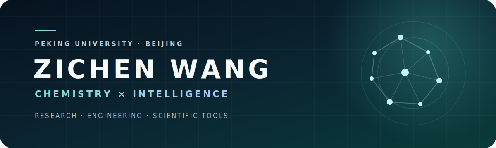

  

  <samp>COMPUTATIONAL CHEMISTRY&nbsp;&nbsp;·&nbsp;&nbsp;AI FOR SCIENCE&nbsp;&nbsp;·&nbsp;&nbsp;RESEARCH TOOLING</samp>

## About / 关于我

Hi, I'm Zichen Wang — a researcher and builder working at the intersection of
chemistry, machine intelligence, and scientific software. I enjoy turning
complex research questions into tools and workflows that are clear, reliable,
and genuinely useful.

你好，我是 Zichen Wang。我关注化学、机器智能与科研软件的交叉，也喜欢把复杂的研究问题转化为清晰、可靠、真正有用的工具与工作流。

## Focus / 关注方向

- **Chemistry × AI** — exploring representations, prediction, and discovery
  across molecular and biological systems.
- **Research Tooling** — reducing friction in scientific work through
  thoughtful software and automation.
- **Reliable Engineering** — favoring clear interfaces, reproducible
  workflows, and careful validation.

## Toolkit / 工具箱

  <code>Python</code>&nbsp;
  <code>PyTorch</code>&nbsp;
  <code>Jupyter</code>&nbsp;
  <code>Scientific Computing</code>&nbsp;
  <code>AI Agents</code>&nbsp;
  <code>Git &amp; GitHub</code>

> This page is intentionally quiet: enough to introduce the person, with room
> for the work to speak later.
>
> 这里暂时保持留白：先介绍人，也为未来的作品、论文与合作信息留下空间。

  Stay curious. Build carefully.

<!-- profile:future-selected-work -->
<!-- Add a Selected Work section above the closing note when ready. -->

<!-- profile:future-publications -->
<!-- Add publications, talks, or writing here without changing the header. -->

<!-- profile:future-contact -->
<!-- Add ORCID, a personal website, or a preferred contact channel here. -->
