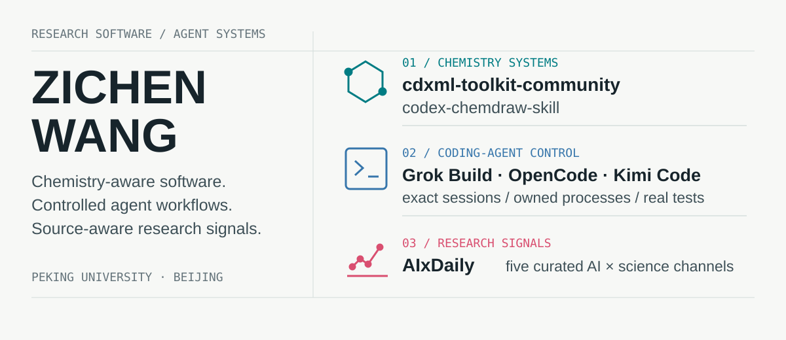

  <picture>
    <source media="(max-width: 520px) and (prefers-color-scheme: dark)" srcset="./assets/header-mobile-dark.svg">
    <source media="(max-width: 520px)" srcset="./assets/header-mobile-light.svg">
    <source media="(prefers-color-scheme: dark)" srcset="./assets/header-dark.svg">
    
  </picture>

  <strong>Chemistry-aware software · controlled agent workflows · research signals</strong> 
  Peking University · Beijing

I build chemistry software, reliable control layers for external coding agents, and source-aware research information systems. My public work focuses on artifacts that can be inspected, resumed, tested, and maintained.

我主要开发化学软件、外部编码代理的可靠控制工具，以及重视来源核验的科研信息系统。公开项目强调可检查、可继续、可测试和可维护。

## Chemistry systems

### [`cdxml-toolkit-community`](https://github.com/ZiChenWang114514/cdxml-toolkit-community)

Community-maintained Python and MCP runtime for grounded structure work, editable CDXML, native ChemDraw rendering, ChemScript, Office objects, and experiment workflows. Its portable CDXML and RDKit features support Windows, macOS, and Linux.

### [`codex-chemdraw-skill`](https://github.com/ZiChenWang114514/codex-chemdraw-skill)

A Codex Skill that turns chemistry requests into controlled toolkit workflows, with progressive documentation, exact MCP signatures, capability-aware installation, and native verification on licensed Windows hosts.

## Coding-agent control

### [`codex-grok-build-skill`](https://github.com/ZiChenWang114514/codex-grok-build-skill)

Launch, resume, supervise, compact, and independently verify Grok Build CLI sessions using exact working directories, session IDs, context signals, logs, processes, and project tests.

### [`codex-opencode-skill`](https://github.com/ZiChenWang114514/codex-opencode-skill)

Create or continue isolated OpenCode sessions through a temporary authenticated localhost service, with explicit model selection, structured results, and process ownership.

### [`codex-kimi-session-skill`](https://github.com/ZiChenWang114514/codex-kimi-session-skill)

Start, resume, inspect, and validate local Kimi Code sessions with exact session ownership, original working directories, structured metadata, and isolated smoke tests.

## Research signals

### [`AIxDaily`](https://github.com/ZiChenWang114514/ai-x-daily) · [Live site](https://zichenwang114514.github.io/ai-x-daily/)

A five-channel daily research digest for AI × Chemistry, AI × Biology, AI × Mathematics, AI Voices, and Engineering, with historical duplicate checks, structured public data, and GitHub Pages publication.

  Ground structures · verify sessions · preserve sources

